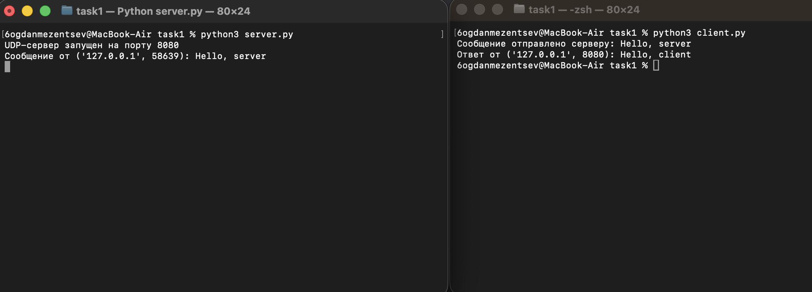
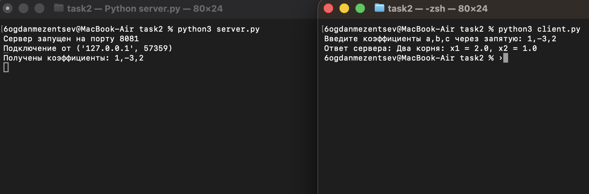
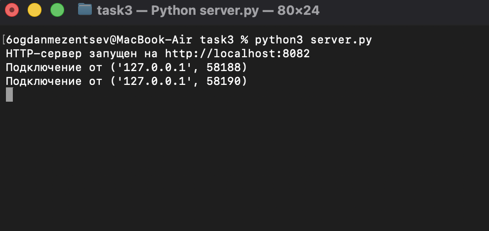
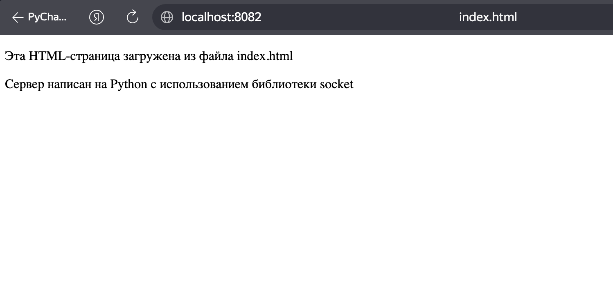
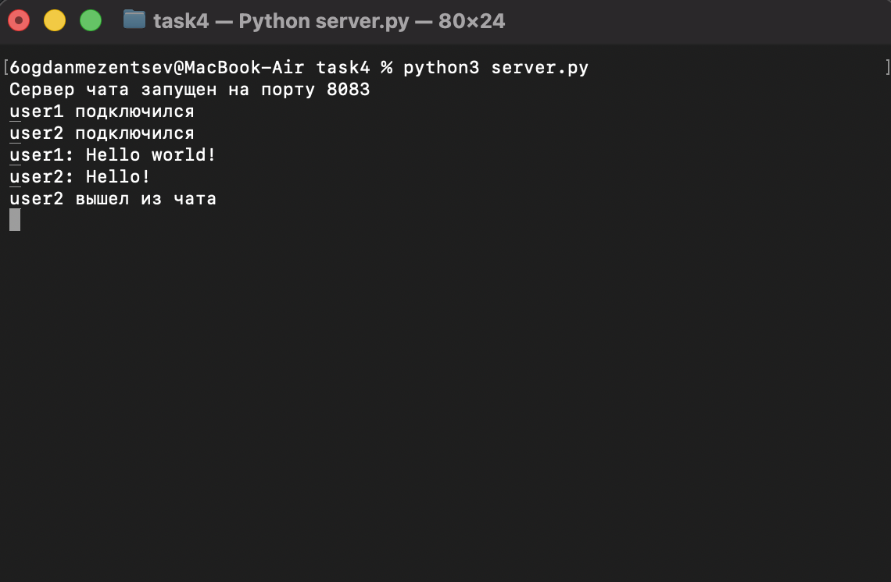
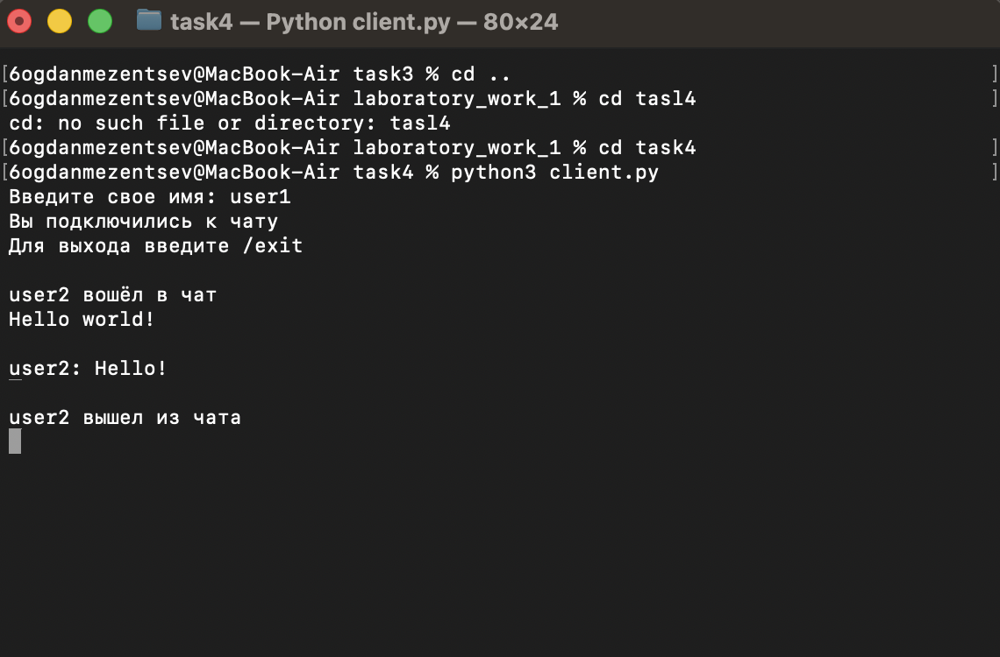
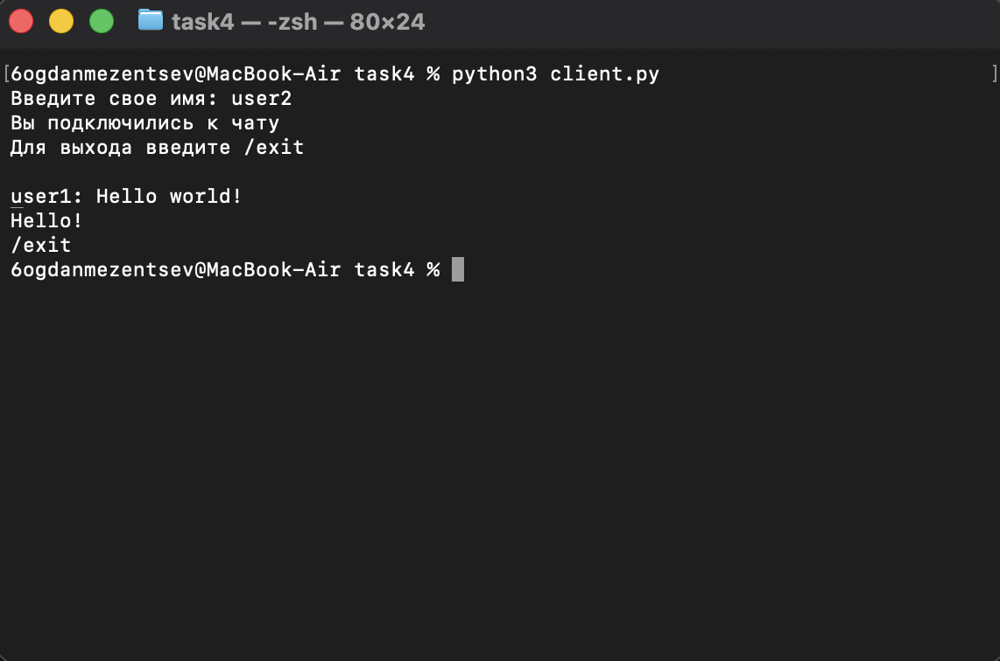
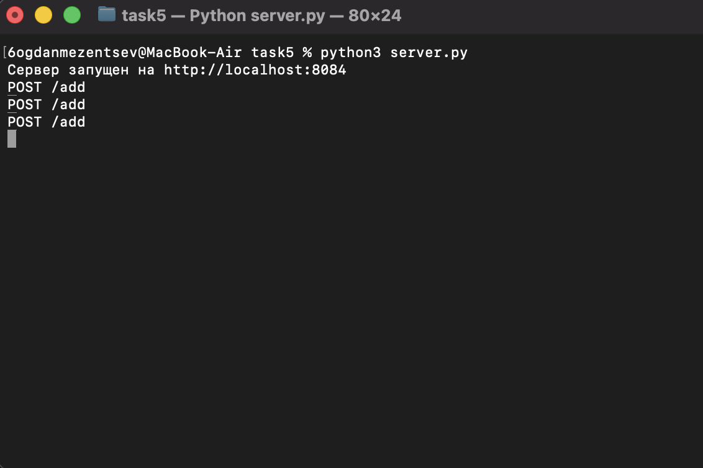
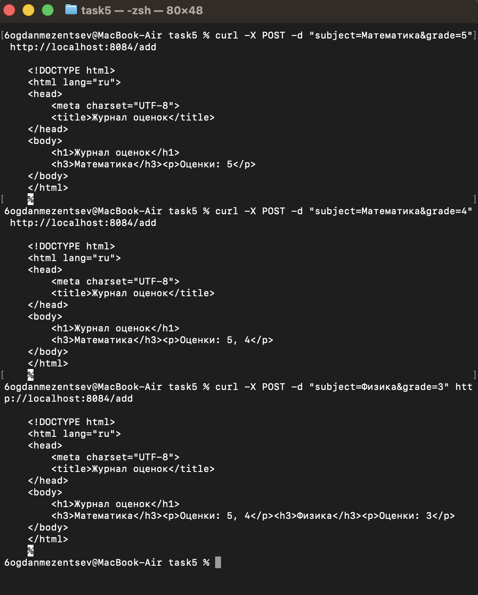

# Лабораторная работа № 1. Работа с сокетами

**Студент:** Мезенцев Богдан<br>
**Группа:** К3339

## Задание 1. Обмен сообщениями по UDP

Клиент отправляет серверу сообщение `Hello, server`, а сервер отвечает
`Hello, client`. Для обмена по UDP используются `SOCK_DGRAM`, `sendto()` и
`recvfrom()`.

### Код сервера

```python
import socket


with socket.socket(socket.AF_INET, socket.SOCK_DGRAM) as server_socket:
    server_socket.bind(("localhost", 8080))
    print(f"UDP-сервер запущен на порту 8080")

    try:
        while True:
            data, client_address = server_socket.recvfrom(1024)
            message = data.decode("utf-8")

            print(f"Сообщение от {client_address}: {message}")

            response = "Hello, client"
            server_socket.sendto(response.encode("utf-8"), client_address)
    except KeyboardInterrupt:
        print("\nСервер остановлен.")
```

### Код клиента

```python
import socket


with socket.socket(socket.AF_INET, socket.SOCK_DGRAM) as client_socket:
    message = "Hello, server"
    client_socket.sendto(message.encode("utf-8"), ("localhost", 8080))
    print(f"Сообщение отправлено серверу: {message}")

    data, server_address = client_socket.recvfrom(1024)
    response = data.decode("utf-8")
    print(f"Ответ от {server_address}: {response}")
```

Пример работы:

```text
Сервер: Сообщение от ('127.0.0.1', 53124): Hello, server
Клиент: Ответ от ('127.0.0.1', 8080): Hello, client
```

Примеры работы в терминале:



---

## Задание 2. Вычисления через TCP

Для номера 18 в журнале выбран вариант 2 — решение квадратного уравнения.
Клиент передаёт коэффициенты по протоколу TCP, сервер вычисляет корни уравнения и возвращает
результат.

### Код сервера

```python
import math
import socket


server_socket = socket.socket(socket.AF_INET, socket.SOCK_STREAM)
server_socket.bind(("localhost", 8081))
server_socket.listen(1)
print("Сервер запущен на порту 8081")

while True:
    client_socket, client_address = server_socket.accept()
    print(f"Подключение от {client_address}")

    client_data = client_socket.recv(1024).decode()
    print(f"Получены коэффициенты: {client_data}")

    a, b, c = map(float, client_data.split(","))
    discriminant = b**2 - 4 * a * c

    if discriminant > 0:
        x1 = (-b + math.sqrt(discriminant)) / (2 * a)
        x2 = (-b - math.sqrt(discriminant)) / (2 * a)
        result = f"Два корня: x1 = {x1}, x2 = {x2}"
    elif discriminant == 0:
        x = -b / (2 * a)
        result = f"Один корень: x = {x}"
    else:
        result = "Действительных корней нет"

    client_socket.sendall(result.encode())
    client_socket.close()
```

### Код клиента

```python
import socket


client_socket = socket.socket(socket.AF_INET, socket.SOCK_STREAM)
client_socket.connect(("localhost", 8081))

coefficients = input("Введите коэффициенты a,b,c через запятую: ")
client_socket.sendall(coefficients.encode())

result = client_socket.recv(1024).decode()
print(f"Ответ сервера: {result}")

client_socket.close()
```

Пример работы:

```text
Введите коэффициенты a,b,c через запятую: 1,-3,2
Ответ сервера: Два корня: x1 = 2.0, x2 = 1.0
```

Примеры работы в терминале:


---

## Задание 3. Раздача HTML-страницы по HTTP

Сервер читает файл `index.html`, формирует HTTP-ответ с заголовками и отправляет
страницу клиенту через TCP.

### Код сервера

```python
import socket


server_socket = socket.socket(socket.AF_INET, socket.SOCK_STREAM)
server_socket.bind(("localhost", 8082))
server_socket.listen(5)
print("HTTP-сервер запущен на http://localhost:8082")

while True:
    client_socket, client_address = server_socket.accept()
    print(f"Подключение от {client_address}")

    with open("index.html", "r", encoding="utf-8") as file:
        html = file.read()

    html_bytes = html.encode("utf-8")

    headers = (
        "HTTP/1.1 200 OK\r\n"
        "Content-Type: text/html; charset=utf-8\r\n"
        f"Content-Length: {len(html_bytes)}\r\n"
        "Connection: close\r\n"
        "\r\n"
    )

    response = headers.encode("utf-8") + html_bytes
    client_socket.sendall(response)
    client_socket.close()
```

### Файл index.html

```html
<!DOCTYPE html>
<html lang="ru">
<head>
    <meta charset="UTF-8">
    <title>index.html</title>
</head>
<body>
    <p>Эта HTML-страница загружена из файла index.html</p>
    <p>Сервер написан на Python с использованием библиотеки socket</p>
</body>
</html>
```

Страница открывается по адресу `http://localhost:8082`.

Примеры работы в терминале:





---

## Задание 4. Многопользовательский TCP-чат

Сервер создаёт отдельный поток для каждого клиента и рассылает сообщения всем,
кроме отправителя. Пользователи идентифицируются по имени, для выхода
используется команда `/exit`.

### Код сервера

```python
import socket
import threading


clients = {}


def send_to_all_clients(message, sender_socket=None):
    for client_socket in list(clients):
        if client_socket != sender_socket:
            try:
                client_socket.sendall(message.encode())
            except:
                continue


def handle_client(client_socket):
    username = client_socket.recv(1024).decode()
    clients[client_socket] = username

    print(f"{username} подключился")
    client_socket.sendall("Вы подключились к чату".encode())
    send_to_all_clients(f"{username} вошёл в чат", client_socket)

    while True:
        try:
            message = client_socket.recv(1024).decode()

            if not message or message == "/exit":
                break

            print(f"{username}: {message}")
            send_to_all_clients(f"{username}: {message}", client_socket)
        except:
            break

    del clients[client_socket]
    client_socket.close()

    print(f"{username} вышел из чата")
    send_to_all_clients(f"{username} вышел из чата")


server_socket = socket.socket(socket.AF_INET, socket.SOCK_STREAM)
server_socket.bind(("localhost", 8083))
server_socket.listen()

print("Сервер чата запущен на порту 8083")

while True:
    client_socket, client_address = server_socket.accept()

    thread = threading.Thread(target=handle_client, args=(client_socket,))
    thread.start()
```

### Код клиента

```python
import socket
import threading


def receive_messages():
    while True:
        try:
            message = client_socket.recv(1024).decode()

            if not message:
                break

            print(f"\n{message}")
        except:
            break


client_socket = socket.socket(socket.AF_INET, socket.SOCK_STREAM)
client_socket.connect(("localhost", 8083))

username = input("Введите свое имя: ")
client_socket.sendall(username.encode())

welcome_message = client_socket.recv(1024).decode()
print(welcome_message)
print("Для выхода введите /exit")

thread = threading.Thread(target=receive_messages)
thread.daemon = True
thread.start()

while True:
    message = input()
    client_socket.sendall(message.encode())

    if message == "/exit":
        break

client_socket.close()
```

Пример работы:

```text
User1 подключился
User2 подключился
User1: Привет, User2!
User2: Привет, User1!
User2 вышел из чата
```

Примеры работы в терминале:







---

## Задание 5. Веб-сервер GET/POST

Запрос `POST /add` добавляет оценку, а `GET /` возвращает HTML-страницу
журнала. Оценки хранятся в словаре и группируются по дисциплинам.

### Код сервера

```python
import socket
from urllib.parse import parse_qs


grades = {}


def create_page_with_grades():
    grades_html = ""

    for subject, subject_grades in grades.items():
        grades_html += f"<h3>{subject}</h3>"
        grades_html += f"<p>Оценки: {', '.join(subject_grades)}</p>"

    if not grades_html:
        grades_html = "<p>Оценок пока нет.</p>"

    return f"""
    <!DOCTYPE html>
    <html lang="ru">
    <head>
        <meta charset="UTF-8">
        <title>Журнал оценок</title>
    </head>
    <body>
        <h1>Журнал оценок</h1>
        {grades_html}
    </body>
    </html>
    """


server_socket = socket.socket(socket.AF_INET, socket.SOCK_STREAM)
server_socket.bind(("localhost", 8084))
server_socket.listen()
print("Сервер запущен на http://localhost:8084")

while True:
    client_socket, client_address = server_socket.accept()
    request = client_socket.recv(1024).decode("utf-8")

    if not request:
        client_socket.close()
        continue

    request_line = request.split("\r\n")[0]
    method, path, _ = request_line.split()

    print(method, path)

    if method == "POST" and path == "/add":
        body = request.split("\r\n\r\n", 1)[1]
        form_data = parse_qs(body)
        subject = form_data["subject"][0]
        grade = form_data["grade"][0]

        grades.setdefault(subject, []).append(grade)

    html = create_page_with_grades()
    html_bytes = html.encode("utf-8")

    response_headers = (
        "HTTP/1.1 200 OK\r\n"
        "Content-Type: text/html; charset=utf-8\r\n"
        f"Content-Length: {len(html_bytes)}\r\n"
        "Connection: close\r\n"
        "\r\n"
    )

    client_socket.sendall(response_headers.encode("utf-8") + html_bytes)
    client_socket.close()
```

Пример добавления оценок:

```bash
curl -X POST -d "subject=Математика&grade=5" http://localhost:8084/add
curl -X POST -d "subject=Математика&grade=4" http://localhost:8084/add
curl -X POST -d "subject=Физика&grade=3" http://localhost:8084/add
```

Результат запроса `GET /`:

```text
Математика
Оценки: 5, 4

Физика
Оценки: 3
```




